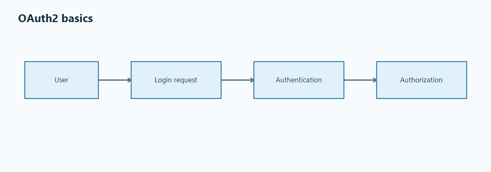
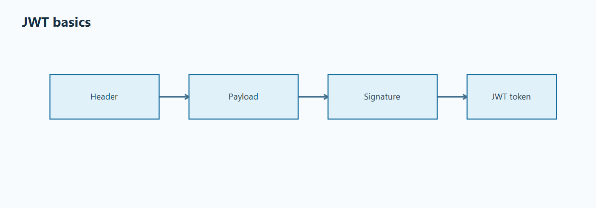
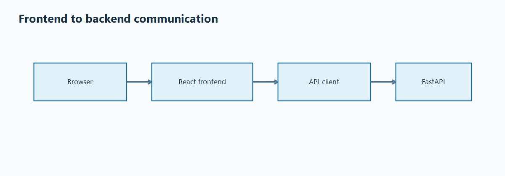
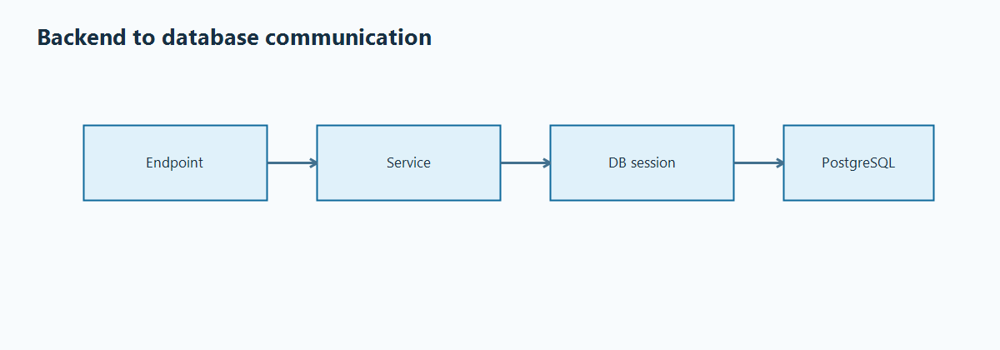
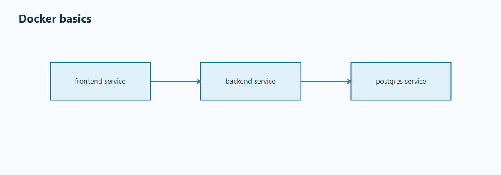
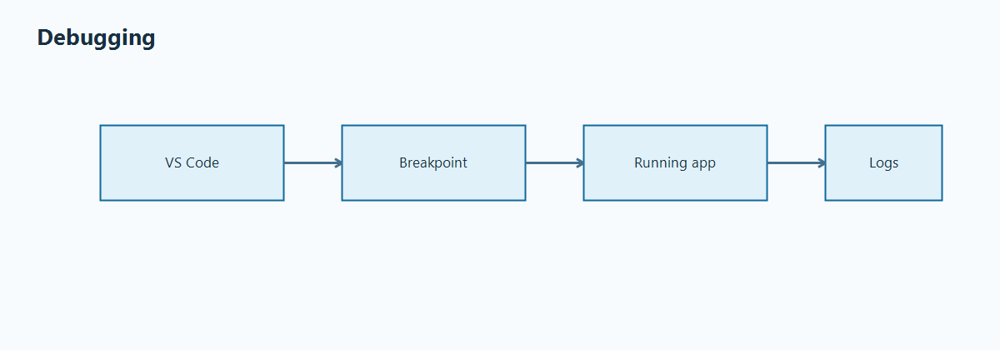
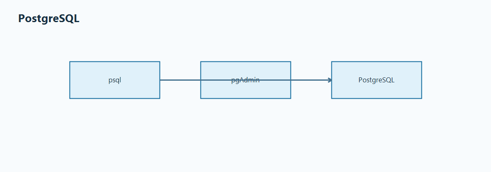
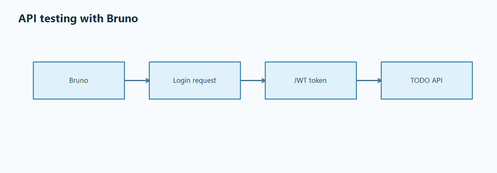
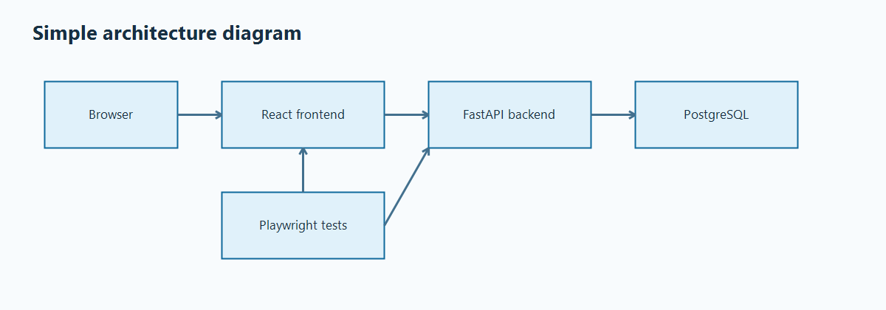

# Learning Notes

This file explains the main ideas in very simple language.

## 1. OAuth2 basics



### Authentication vs authorization

- Authentication means proving who you are.
- Authorization means checking what you are allowed to do.

In this app:
- login is authentication
- checking TODO ownership is simple authorization logic inside the backend

There is no RBAC here.

If this app became bigger, RBAC could add things like:
- admin role
- manager role
- special permission to view other users' data

### What login does in this app

1. Frontend sends username and password to `/api/auth/token`.
2. Backend checks the user in the database.
3. Backend verifies the password hash.
4. Backend returns a JWT access token.
5. Frontend stores that token in local storage.

Relevant code:
- backend login endpoint: [backend/app/api/auth.py](/c:/Users/Neko/source/repos/SmallAppForAutomationTesting/backend/app/api/auth.py)
- frontend login request: [frontend/src/api/client.ts](/c:/Users/Neko/source/repos/SmallAppForAutomationTesting/frontend/src/api/client.ts)

## 2. JWT basics



JWT means JSON Web Token.

It is a signed string that usually has 3 parts:
- header: tells what algorithm is used
- payload: contains data like the user id and expiry time
- signature: proves the token was signed with the secret key

### Access token flow in this app

1. User logs in.
2. Backend creates a JWT with the user id in `sub`.
3. Frontend stores the token.
4. Frontend sends the token in `Authorization: Bearer <token>`.
5. Backend reads the token and loads the current user.

### Where frontend stores and sends the token

- storage helper: [frontend/src/lib/auth.ts](/c:/Users/Neko/source/repos/SmallAppForAutomationTesting/frontend/src/lib/auth.ts)
- API client: [frontend/src/api/client.ts](/c:/Users/Neko/source/repos/SmallAppForAutomationTesting/frontend/src/api/client.ts)
- backend token decode: [backend/app/core/security.py](/c:/Users/Neko/source/repos/SmallAppForAutomationTesting/backend/app/core/security.py)

### Why this app is not a production security example

- simple secret key
- simple test passwords
- token stored in local storage
- no refresh tokens
- no rate limiting
- no secret manager

That is okay here because this project is for learning local development and test automation.

## 3. Frontend to backend communication



All frontend API calls are in one file:
- [frontend/src/api/client.ts](/c:/Users/Neko/source/repos/SmallAppForAutomationTesting/frontend/src/api/client.ts)

The frontend backend URL and port are set in two places:
- default API base URL in [frontend/src/api/client.ts](/c:/Users/Neko/source/repos/SmallAppForAutomationTesting/frontend/src/api/client.ts)
- environment variable in [frontend/.env.example](/c:/Users/Neko/source/repos/SmallAppForAutomationTesting/frontend/.env.example) as `VITE_API_BASE_URL`

Example:
- `http://localhost:8000`

### How login request works

- function `login()` sends form data to `/api/auth/token`

### How TODO requests work

- `getTodos()` sends `GET /api/todos?due_date=YYYY-MM-DD`
- `createTodo()` sends `POST /api/todos`
- `updateTodo()` sends `PUT /api/todos/{id}`
- `deleteTodo()` sends `DELETE /api/todos/{id}`

### How JWT is sent

The API client adds this header:

```text
Authorization: Bearer <token>
```

## 4. Backend to database communication



### Where models are

- SQLAlchemy models: [backend/app/models.py](/c:/Users/Neko/source/repos/SmallAppForAutomationTesting/backend/app/models.py)

### Where DB session is created

- engine and session factory: [backend/app/db.py](/c:/Users/Neko/source/repos/SmallAppForAutomationTesting/backend/app/db.py)

### How CRUD works

- endpoint layer calls service functions
- service functions use SQLAlchemy session
- service functions create, read, update, and delete rows

Relevant code:
- TODO endpoints: [backend/app/api/todos.py](/c:/Users/Neko/source/repos/SmallAppForAutomationTesting/backend/app/api/todos.py)
- TODO service: [backend/app/services/todo_service.py](/c:/Users/Neko/source/repos/SmallAppForAutomationTesting/backend/app/services/todo_service.py)

## 5. Docker basics



### What Dockerfile is

A Dockerfile says how to build an image.

### What Docker Compose is

Docker Compose starts many services together.

### What service means

A service is one running part of the app, for example:
- frontend
- backend
- postgres

### Image, container, volume, network

- image: template used to start a container
- container: running instance of an image
- volume: persistent storage
- network: how containers talk to each other

### How services talk to each other in Docker

- frontend in browser calls backend on `localhost:8000`
- backend container connects to postgres container with host name `postgres`

Files:
- prod-like compose: [docker/docker-compose.yml](/c:/Users/Neko/source/repos/SmallAppForAutomationTesting/docker/docker-compose.yml)
- dev compose: [docker/docker-compose.dev.yml](/c:/Users/Neko/source/repos/SmallAppForAutomationTesting/docker/docker-compose.dev.yml)

## 6. Debugging



### Debug backend locally

Use VS Code config `Backend: Local`.

### Debug frontend locally

Start `npm run dev` in `frontend/`, then use `Frontend: Chrome`.

### Attach VS Code debugger to Docker

Development compose exposes these ports:
- backend debugpy: `5678`
- frontend Node inspector: `9229`

Use these VS Code configs:
- `Backend: Attach Docker`
- `Frontend: Attach Docker`

### Common debugging tips

- put breakpoints near request handling code first
- check browser dev tools network tab
- check backend logs in terminal
- confirm token exists before calling protected endpoints
- test API in Swagger UI first when UI looks wrong

## 7. PostgreSQL



### Connect to PostgreSQL in Docker

Example from host machine:

```powershell
psql -h localhost -p 5432 -U postgres -d todo_app
```

### Example psql commands

```sql
\dt
SELECT id, username FROM users;
SELECT id, title, due_date, owner_id FROM todos ORDER BY id;
SELECT * FROM todos WHERE owner_id = 1;
```

### Use pgAdmin as alternative

You can connect pgAdmin to:
- host: `localhost`
- port: `5432`
- username: `postgres`
- password: `postgres`
- database: `todo_app`

## 8. API testing with Bruno



Bruno is a simple API client, like Postman.

### Login example

Request:

```http
POST /api/auth/token
Content-Type: application/x-www-form-urlencoded

username=alice&password=alice123
```

Copy the `access_token` value from the response.

### Send JWT token in header

```text
Authorization: Bearer <your-token>
```

### Get TODOs example

```http
GET /api/todos?due_date=2026-05-27
Authorization: Bearer <your-token>
```

### Create TODO example

```http
POST /api/todos
Authorization: Bearer <your-token>
Content-Type: application/json

{
  "title": "Write Bruno check",
  "description": "Created from Bruno",
  "due_date": "2026-05-27",
  "completed": false
}
```

### Update TODO example

```http
PUT /api/todos/1
Authorization: Bearer <your-token>
Content-Type: application/json

{
  "title": "Write Bruno check updated",
  "description": "Updated from Bruno",
  "due_date": "2026-05-27",
  "completed": true
}
```

### Delete TODO example

```http
DELETE /api/todos/1
Authorization: Bearer <your-token>
```

### More realistic API testing examples

#### Negative auth test

Try wrong password:

```http
POST /api/auth/token
Content-Type: application/x-www-form-urlencoded

username=alice&password=wrong-password
```

Expected result: `401 Unauthorized`

#### User isolation test

1. Login as `bob`
2. Create a TODO and copy its id
3. Login as `alice`
4. Try to update Bob's TODO id

Expected result: `404 TODO not found`

The app hides other users' TODO items.

#### Invalid payload validation test

Send missing title:

```http
POST /api/todos
Authorization: Bearer <your-token>
Content-Type: application/json

{
  "description": "Missing title",
  "due_date": "2026-05-27",
  "completed": false
}
```

Expected result: `422 Unprocessable Entity`

## 9. Simple architecture diagram



Request flow:
- Browser -> React frontend -> FastAPI backend -> PostgreSQL
- Playwright -> UI/API -> App

## Simple design choices used here

Some choices are simpler on purpose:
- native HTML date input instead of external datepicker library
- no frontend router because the app only has two simple views
- no Alembic because table creation is enough for learning
- no refresh tokens because basic access token flow is easier to understand first